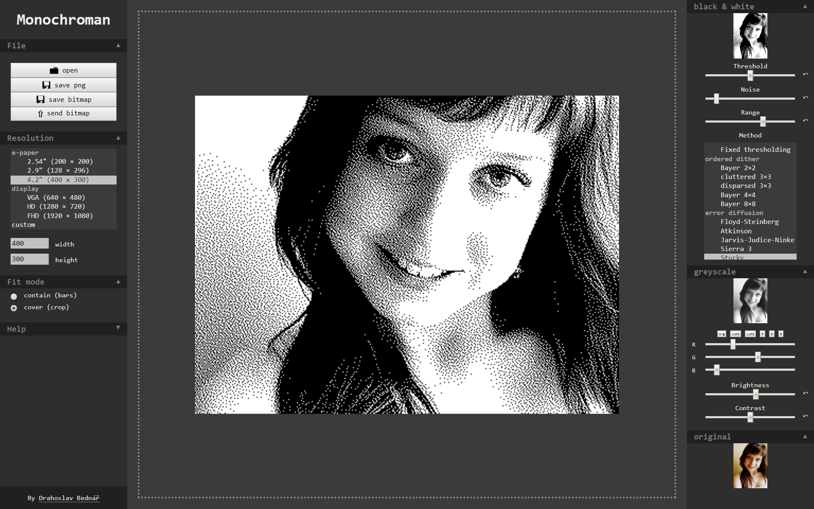

# Monochroman

Web based generator of monochromatic images.

## What is it for
It generates black & white (just two colors, not grayscale) images.

It can be used for monochromatis displays (e-paper / e-ink) which are capable of producing only 2 colors.

Also for artistic purposes.

## What it can do
Several types of dithering filters:
 - fixed treshold
 - ordered filters
    - simple cluttered/disparsed 3×3
    - Bayer 2x2, 4×4, 8×8
 - error diffustion filters
    - Floyd-Steinberg
    - Atkinson 
    - Jarvis-Judice-Ninke
    - Sierra 3
    - Stucky
  
Aditional features:
 - Add noise to prevent digital artifacts from occuring
 - Adjust brightness and contrast of intermediate grayscale image
 - Narrow range of depth in which error diffusion is applyed

## I/O

- Can open files of common image formats (**png**, **jpeg** and whatewer si compatible with html5 canvas)
- Can save to **png** or co custom **bitmap** format.
- Can POST bitmap over http to somewhere.

### Bitmap format

Outputed bitmap format is very simple. First 4 bytes define width and height (Big endian), rest is bitmap itself - one bit per pixel.

Eg.: *(file with 8×8 chess pattern)* 

bin:
```
 00000000 00001000 > width
 00000000 00001000 > height
 01010101 10101010 \
 01010101 10101010  \ pixels 
 01010101 10101010  / 0=Black, 1=White
 01010101 10101010 / 
```
hex:
```
 00 08 00 08 AA 55 AA 55 AA 55 AA 55
```

### Backend connection
Edit `BACKEND_URL` constant on line 6 to enable pushing bitmap to your http server to which `send button` will be sending bitmap, where you can do whatewer you want with it

*TODO - commit example of own backend*

## UI


## Source of knowlge
  - http://www.efg2.com/Lab/Library/ImageProcessing/DHALF.TXT
